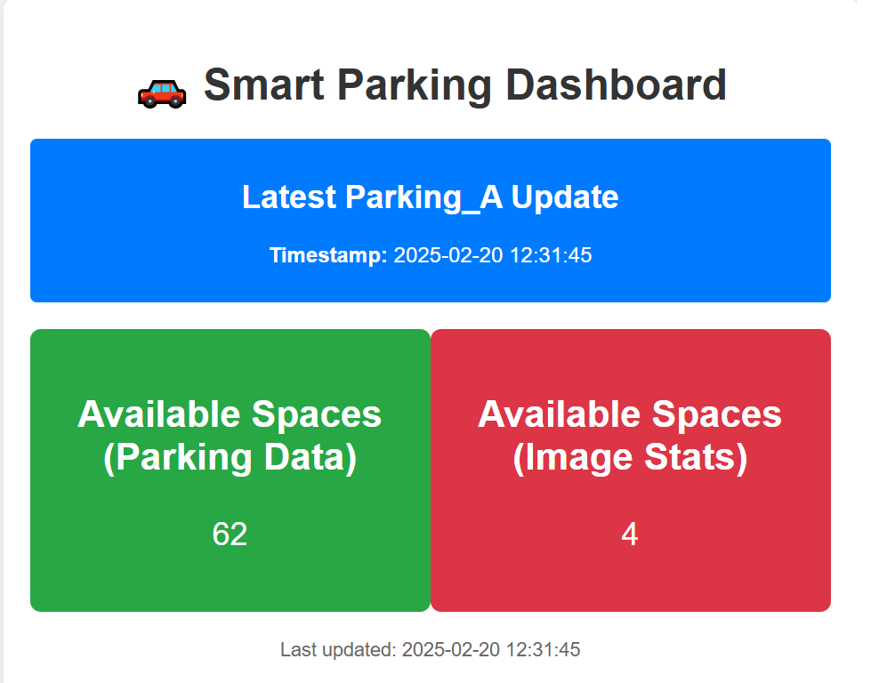

# 🚗 Smart Parking Dashboard

This project is a **real-time Smart Parking Management System** that monitors parking availability using data stored in **MongoDB**. The dashboard displays:
- **Available spaces in Parking_A** (calculated from `parking_data`).
- **Available spaces from image analysis** (from `image_stats`).
- **Last updated timestamp**
- **Automatic refresh every 5 second** for real-time updates.

## Preview
## 📷 Preview
  
(*Smart Parking Dashboard in action*)

## **📌 Prerequisites**
### ** System Requirements**
- **Operating System:** Works on Windows, Linux, or macOS  
- **Python Version:** `Python 3.7+`  
- **MongoDB:** A running instance of MongoDB (`4.0+` recommended)  
- **Flask Framework:** For serving the web application  

### ** Steps to run the program**
# 1️⃣ Clone the Repository
git clone https://github.com/your-username/smart-parking-dashboard.git
cd smart-parking-dashboard

# 2️⃣ Build and Start the Containers
docker-compose up --build -d

# 3️⃣ Start the IoT Data Producer
python3 producer.py

# 4️⃣ Start the Image Producer
python3 producer_images.py

# 5️⃣ Start the IoT Data Consumer
python3 consumer.py

# 6️⃣ Start the Image Consumer
python3 consumer_image.py

# 7️⃣ Start the Flask Web Server
python3 app.py
# 8️⃣ navigate to the local host
http://localhost:5000/

